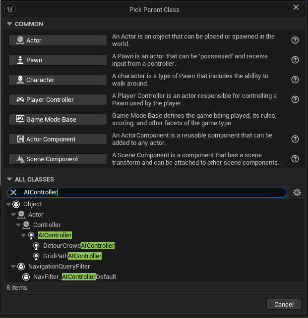
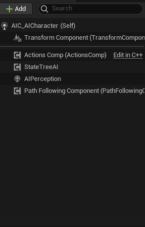
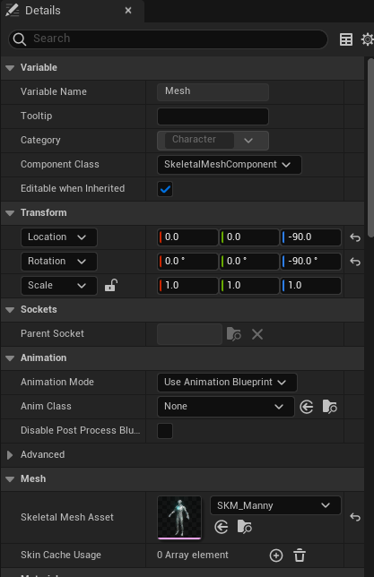

# State Trees

State trees are a tool use to manage the state of an Actor or AI Character.

## AI State Tree

AI State trees are used by AI Characters to determine what actions they should be doing.  Should they be idle?  Should they patrol?  Should they chase down another Actor/Character in the area.

## Creating a AI Character using an AI state tree.

### Installing the required plugins.
There are 2 plugins that are required for using state trees

* Gameplay State Tree
* State Tree

Now restart your project.

### Setting up your folder structure.

Create a folder called `AI`, we will put all of our work inside this base folder.  Inside the `AI` folder create the following folders `AIControllers`, `Blueprints`,  `Data`, `Statetrees`,  and `Tasks`.

### Setting up your AI Controller

In the `AIControllers` folder create a new blueprint of type `AIController`.  You will need to use the search box on the blueprint create modal to find it.  

Call it `AIC_AICharacter`.  Inside the blueprint attached an `AIPerception` component, and a `StateTreeAI` component. 

 We will make use of these during the process, but let's add them now so we have them when we need them.

### Setting up your AI Character.

In the `Blueprints` folder create a Character Blueprint and call it `BP_AICharacter`.  In the `BP_AICharacter` select the "StaticMesh" and add `SKM_Manny` as yoru static mesh.  Adjust the z axis location and rotation by -90.  There is nothing left to do here at the moment.

Compile save and close.

### Create the Statetrees

In `Statetrees` folder create a new blueprint.  Right click in the folder, go to `Artificial Intelligence` and choose `StateTree`.

### Adding a NavMeshBoundsVolume

In order for your AI Character to move you will need to add a NavMeshBounds volume to your level map.

###

